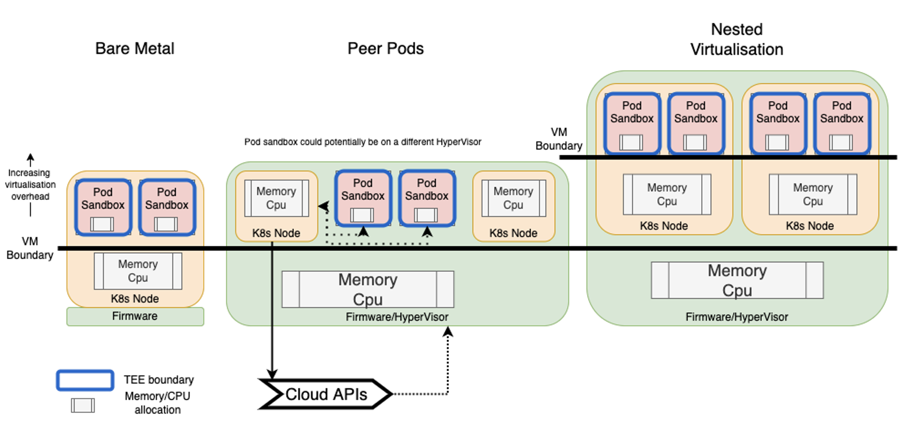
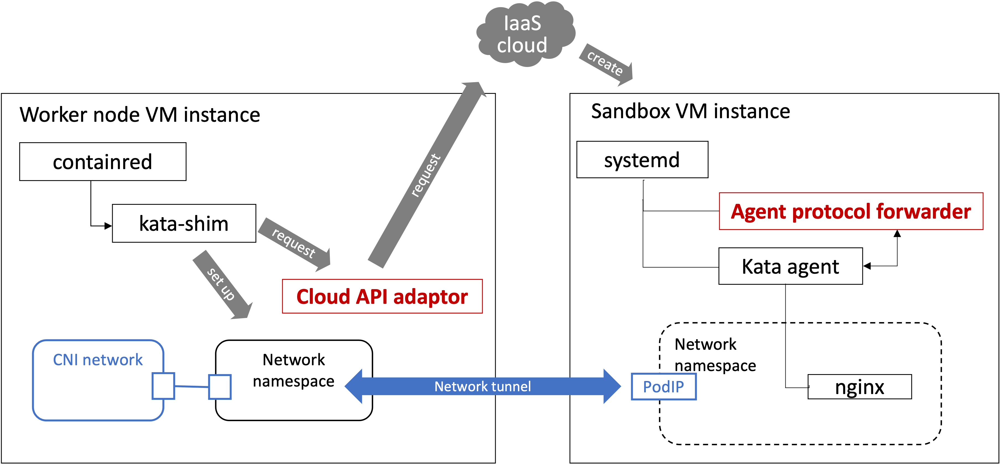

# Peer Pods Architecture

## Overview

The cloud-api-adaptor is an implementation of the
[remote hypervisor interface](https://github.com/kata-containers/kata-containers/blob/main/src/runtime/virtcontainers/remote.go)
of [Kata Containers](https://github.com/kata-containers/kata-containers)

It enables the creation of Kata Containers VMs on any machines without the need for bare metal worker nodes,
or nested virtualisation support.

## Background

With the Confidential Containers (CoCo) projects we are aiming to deliver a confidential computing enabled Kubernetes Platform
providing:
- **Security and Confidentiality** - We want to provide highly secure solutions to our users' applications, limiting the
actions of the cloud service provider (CSP), or Kubernetes Admins and providing assurance that their data and workloads
remain confidential and safe from modification.
- **Performance** - We want to maximise performance, whilst accepting that there is a trade-off to gain extra security.
- **Compatibility with established Cloud Native Applications** - We don't want our users to have to re-write their
workloads just to get confidential computing features, but to be able to bring along any Kubernetes workload with
minimal changes.

The way that we do this is utilise Trusted Execution Environments (TEEs). These are areas of hardware where code is
executed with the following features:
- Hardware root-of-trust
- Remote Attestation
- Trusted launch
- Memory encrypted and isolated
- Secure key management

Many TEEs such as SNP, TDX and Secure Execution use virtual machines as the trusted boundary of the hardware, and in
order to be compatible with existing Kubernetes deployments, we put the TEE boundary around the Pod Sandbox, not the
whole Kubernetes node, so Kubernetes' orchestration can still work without modification, so we have some different
options of how to lay out this infrastructure.

### Bare Metal

In order make the TEE VM a first-level KVM guest, the current way to set-up Kubernetes infrastructure is to have a
whole bare metal machine as the Kubernetes node and inside of that we can have 1 or more TEE VMs, in which we
can run our pod sandboxes.
Although this is the traditional way to currently configure a Kata Containers VMs in the cloud, there is a big
drawback of having to have a separate bare metal box per Kubernetes node, which is expensive and difficult to scale.

### Nested Virtualisation

Most current cloud providers need to have the scalabilty and cost savings that bare metal nodes cannot provide, so
utilise virtual servers. These partition up the physical processing power and resources into multiple systems that
can each run their own operating system. A common model in non-confidential Kubernetes infrastructure is to have a
Kubernetes node map to a virtual server, so each physical server can run multiple nodes and each of them could run
multiple pod sandboxes. Currently there are limitation of not being able to run as a second-level VM in a performant
way for most TEEs and CSPs, means we can't put these pod sandboxes inside a TEE boundary in these scenarios.

### Peer pods

The peer pod approach is to compromise between the two previous models - using a TEE environment as a first-level KVM,
but not having to dedicate a whole machine to a single Kubernetes node and therefore getting the flexibility of
virtualisation.
In this model the pod sandbox is not within the Kubernetes node, using some of its resources, but an independent VM
that runs in the same cloud as a first-level KVM peer of the Kubernetes node. CSP IaaS APIs can be used to create these
new TEE-based VMs on demand for the pod sandboxes and we can create a network tunnel between the node and sandbox for
commands to flow.

There are some limitations and advantages of this approach including:

#### Limitations

In the current Kata Containers approach, the container runtime creates a pod sandbox as a VM inside the Kubernetes node
using a local hypervisor and then uses a local virtual network to communicate to it. Compared to this existing approach,
using CSP IaaS APIs to create a new VM per pod sandbox adds an overhead in time and resources. This means the peer pods
solution probably won't work well for small, short-lived applications.
Using a virtual network to communicate between the node (host) and the pod sandbox (guest) components, the approach of
peer pods is more complicated as well.

#### Advantages
Due to the lack of wide availability of running TEEs in nested VM, if we want to use TEEs, then compared to having a bare
metal machine per node, we can scale more easily and cheaply.
There is also some advantages to the independence of peer pods, where each pod sandbox has it's own dedicated resources
like network and storage, rather than sharing these with the Kubernetes node and other pods. This can help to improve
resource management, reliability as well as security.

## Components

The diagram below shows the components that are installed into a Kubernetes cluster when Peer pods is enabled

<!--the architecture diagram needs updating with the extra components Issue #1291-->

<!-- TODO - do we want to add lots of info here, or point to READMEs in the different components' directories?-->

### Cluster node components

There are a few components that Peer pods needs to be running either on the worker node, or the control-plane node.

### `containerd-shim-kata-v2`

The [`shim v2`](https://github.com/kata-containers/kata-containers/blob/main/docs/design/architecture/README.md#shim-v2-architecture)
part of the Kata Containers runtime, implements the containerd runtime v2 API for Kata Containers and allows it to
receive commands from Kubernetes, via a CRI client to launch and run Pods.

### Cloud API Adaptor
The [cloud-api-adaptor](../src/cloud-api-adaptor/cmd/cloud-api-adaptor) implements the remote hypervisor. It runs as a daemonset on
each node and is responsible for receiving commands from the `containerd-shim-kata-v2` process and implementing them
for peer pods. For example, when it receives commands that were related to Pod lifecycle that are traditionally
serviced by a local hypervisor (like `CreateSandboxRequest` and `StopSandboxRequest`) it will use IaaS APIs (from the
Cloud Service Provider, or locally for the `libvirt` implementation to creating and deleting the peer pod VMs.

When the VMs are created they make a CNI compatible network tunnel using VxLAN tunneling, between the worker node and
peer pods VM to flow other commands like `CreateContainer` through to the the remote sandbox.

### Webhook
The [webhook](../src/webhook/) is an mutating admission controller that modifies a pod spec using specific runtimeclass to
remove all resources entries and replace it with peer-pod extended resource. This is needed as unlike a standard pod, a
peer pod will not consume the worker node's resources in the same way.

### peerpod-ctrl

The [peerpod-ctrl](../src/peerpod-ctrl/) is a Kubernetes controller that is used to track the cloud provider resources for
the peer pods. It is responsible for watching PeerPod events and ensuring that any resources that weren't cleaned up by
the cloud-api-adaptor (e.g. in the case of a network error) are deleted.

### CSI wrapper

The [CSI wrapper](../src/csi-wrapper/) plugins (which run on the control place and worker nodes and the peer pod
VM) allows Kubernetes to use Container Storage Interface (CSI) to attach and export persistent volumes to a pod and
have them be attached to the peer pod.

## Peer Pod VM components

In order to create a peer pod VM, each cloud provider needs to have an [image](../src/cloud-api-adaptor/podvm/) created that provides some
components that help to communicate with the worker and run containers on the VM.

### Agent Protocol Forwarder

The [agent-protocol-forwarder](../src/cloud-api-adaptor/cmd/agent-protocol-forwarder) is the process that receives commands from the
cloud-api-adaptor and sends them to the `kata-agent`. In local hypervisor deployments of Kata, the shim talks to the
kata-agent over a virtual socket, which isn't possible over the network to a separate Kata VM, so we use the
agent-protocol-forwarder to act as a bridge and allow a default kata-agent to be used.

### kata-agent

The [kata-agent](https://github.com/kata-containers/kata-containers/blob/main/docs/design/architecture/README.md#agent)
is the process that runs inside the VM and manages the containers and workload running there.
