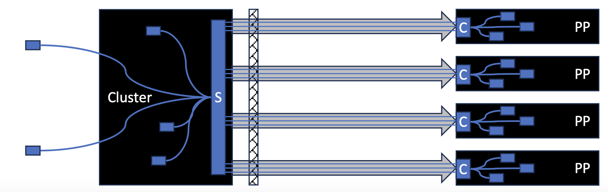

# Secure Communications

Here, we describe how to set up the Secure Communications (`Secure Comms` for short) feature of the `cloud-api-adaptor` (`Adaptor`) and `agent-protocol-forwarder` (`Forwarder`).

The `Secure Comms` feature establishes an SSH channel by the `Adaptor` as an SSH client and the `Forwarder` as an SSH server. All control communications then use this SSH channel between the `Adaptor` and `Forwarder`. Secure Comms use a two-phase approach:
- Attestation Phase: In this phase, an SSH channel is created to enable the Peer Pod to attest against an attestation service. The attestation traffic is tunneled from the Peer Pod to the CAA and from there sent to a KBS as configured at the CAA. Once attestation is achieved, the Forwarder obtains Peer Pod keys from the KBS. The Peer Pod keys are dynamically added to the KBS by the CAA prior to starting the Peer Pod.
- Kubernetes Phase: In this phase, an SSH channel is created to enable the runtime to communicate with the Kata Agent running in the Peer Pod. This phase uses the keys obtained during the Attestation Phase, ensuring that the communication is secured.

Additional tunnels can be established via the SSH channel by configuring the Adaptor and Forwarder as described below.

## Secure Comms Architecture
`Secure Comms` secures the communication between  the cluster Worker Nodes and Peer Pods. The Worker Nodes are assumed to be protected by a firewall and can be kept unreachable from outside of the cluster of Worker Nodes. To communicate with Peer Pods, an SSH channel is created from the Worker Node allocated to run the Peer Pod and the Peer Pod VM. This SSH channel can then be used for all communication between the Peer Pod and the cluster and any back end services running at the cluster or elsewhere. As shown in the diagram, once the SSH channel is created, clients at the Peer Pod VM side such as `KBC`, `Attestation Agent`, etc. may connect to services offered by the cluster side such as `KBS`, `Attestation Services`, etc. At the same time, clients located at the cluster side such as the `Runtime shim`, may connect to services offered by the Peer Pod VM side such as the `Kata Agent`.


<p align="center">
  
</p>

SecureComms uses the following sequence of steps:
- Worker Node creates keys for the Peer Pod and updates Trustee
- Worker Node creates the Peer Pod VM
- Worker Node establishes an "Attestation Phase" SSH channel with the Peer Pod VM
- Peer Pod VM attests and obtain keys from Trustee. The Peer Pod then signal to the Worker Node that the "Attestation Phase" has ended and terminates the "Attestation Phase" SSH channel.
- Worker Node establishes an "Kubernetes Phase" SSH channel with the Peer Pod VM  - Both sides verify the identity of the other side using the keys delivered via Trustee.

Once the "Kubernetes Phase" SSH channel is established, Secure Comms connects the `Runtime shim` to the `Kata Agent` and may also connect other services required by the Peer Pod VM or by containers running inside the Peer Pod.

See [Secure Comms Architecture Slides](./SecureComms.pdf) for more details.

## Setup for CoCo with Trustee

### Deploy CAA
Use any of the option for installing CAA depending on the cloud driver used.

### Deploy Trustee-Operator
Deploy Trustee-Operator by following instructions at [trustee Operator Getting Started](https://github.com/confidential-containers/trustee-operator?tab=readme-ov-file#getting-started).

Make sure to uncomment the secret generation as recommended for both public and private key (`kbs-auth-public-key` and `kbs-client` secrets). After this installation step you should now have the following secrets in the `trustee-operator-system` namespace:

```sh
kubectl get secrets -n trustee-operator-system
NAME                  TYPE     DATA   AGE
kbs-auth-public-key   Opaque   1      28h
kbs-client            Opaque   1      28h
```

Now, you should copy the kbs-client secret from the `trustee-operator-system` namespace to the `confidential-containers-system` namespace. This can be done using:

```sh
kubectl get secret kbs-client -n trustee-operator-system -o json|jq --arg ns "confidential-containers-system" 'del(.metadata["creationTimestamp","resourceVersion","selfLink","uid","annotations"]) | .metadata.namespace |= $ns' |kubectl apply -f -
```

For a testing environment, you may need to change the policy of the KBS and AS using the KBS Client to allow all or fit your own policy. One way to do that is:

```sh
kubectl -n trustee-operator-system exec deployment/trustee-deployment --container as -it -- sed -i.bak 's/^default allow = false/default allow = true/' /opt/confidential-containers/attestation-service/opa/default.rego

kubectl -n trustee-operator-system get cm resource-policy -o yaml | sed "s/default allow = false/default allow = true/"|kubectl apply -f -
```

### Activate the Secure-Comms feature
Activate Secure-Comms at the CAA by changing the `SECURE_COMMS` parameter of the `peer-pods-cm` configMap in the `confidential-containers-system` namespace to `"true"`.  

```sh
kubectl -n confidential-containers-system  get cm peer-pods-cm  -o yaml | sed "s/SECURE_COMMS: \"false\"/SECURE_COMMS: \"true\"/"|kubectl apply -f -
```

Next, we need to signal the Peer Pod to also activate the Secure-Comms feature. This can be done using an `apf.json` file included in the InitData. InitData must be measured and attested together with the podvm measurement to be trusted. In use cases where the InitData is not trusted, [use a podvm image with Secure-Comms enabled by default as shown below.](#build-a-podvm-that-enforces-secure-comms-optional)


Set InitData to point AA and KBC services to IP address 127.0.0.1 and activate Secure-Comms at the Peer Pod:
```sh
cat <<EOF > /tmp/initdata.txt
algorithm = "sha384"
version = "0.1.0"

[data]
"aa.toml" = '''
[token_configs]
[token_configs.coco_as]
url = 'http://127.0.0.1:8080'

[token_configs.kbs]
url = 'http://127.0.0.1:8080'
'''
"apf.json" = '''
{
    secure-comms: true
}
'''
"cdh.toml"  = '''
socket = 'unix:///run/confidential-containers/cdh.sock'
credentials = []
[kbc]
name = 'cc_kbc'
url = 'http://127.0.0.1:8080'
'''
EOF
export INITDATA=`base64 -w 0 /tmp/initdata.txt`
kubectl -n confidential-containers-system  get cm peer-pods-cm  -o yaml | sed 's/^  INITDATA: .*/  INITDATA: '$INITDATA'/'|kubectl apply -f -

```
On the Worker Node side, you may include additional Inbounds and Outbounds configurations to the Adaptor using the `SECURE_COMMS_INBOUNDS` and `SECURE_COMMS_OUTBOUNDS` config points. [See more details regarding Inbounds and Outbounds below.](#adding-named-tunnels-to-the-ssh-channel)

Use `kubectl edit cm peer-pods-cm -n confidential-containers-system` to make such changes in the configMap, for example:
```sh
apiVersion: v1
data:
    ...
    SECURE_COMMS: "true"
    SECURE_COMMS_OUTBOUNDS: "KUBERNETES_PHASE:mytunnel:149.81.64.62:7777"
    ...
```

Set InitData to point KBC services to IP address 127.0.0.1 
```sh
cat <<EOF > /tmp/initdata.txt
algorithm = "sha384"
version = "0.1.0"
[data]
"aa.toml" = '''
[token_configs]
[token_configs.coco_as]
url = 'http://127.0.0.1:8080'

[token_configs.kbs]
url = 'http://127.0.0.1:8080'
'''
"cdh.toml"  = '''
socket = 'unix:///run/confidential-containers/cdh.sock'
credentials = []
[kbc]
name = 'cc_kbc'
url = 'http://127.0.0.1:8080'
'''
EOF
export INITDATA=`base64 -w 0 /tmp/initdata.txt`
kubectl -n confidential-containers-system  get cm peer-pods-cm  -o yaml | sed 's/^\s*INITDATA: .*/  INITDATA: '$INITDATA'/'|kubectl apply -f -
```

You may also include additional Inbounds and Outbounds configurations to the Adaptor using the `SECURE_COMMS_INBOUNDS` and `SECURE_COMMS_OUTBOUNDS` config points. [See more details regarding Inbounds and Outbounds below.](#adding-named-tunnels-to-the-ssh-channel)

Use `kubectl edit cm peer-pods-cm -n confidential-containers-system` to make such changes in the configMap, for example:
```sh
apiVersion: v1
data:
    ...
    SECURE_COMMS: "true"
    SECURE_COMMS_OUTBOUNDS: "KUBERNETES_PHASE:mytunnel:podns:149.81.64.62:7777"
    ...
```

You may also set the KBS address using the `SECURE_COMMS_KBS_ADDR` config point.

> [!NOTE]
> After changing peer-pods-cm ConfigMap, reload the CAA damonset using:
> ```
> kubectl rollout restart daemonset cloud-api-adaptor-daemonset -n confidential-containers-system
> ```
>


## Adding named tunnels to the SSH channel
Named tunnels can be added to the SSH channel. Adding a named tunnel requires adding an Inbound at one of the SSH channel peers and an Outbound at the other SSH channel peer. The Inbound and Outbound both carry the name of the tunnel being created.

            |---------Tunnel----------| 
    Client->Inbound----------->Outbound->Server


Inbounds and Outbounds take the form of a comma separated inbound/outbound tags such that Inbounds are formed as "InboundTag1,InboundTag2,InboundTag3,..." and Outbounds are formed as "OutboundTag1,OutboundTag2,outboundTag3,..."

Each Inbound tag is structured as `Phase:Name:Namespace:Port` or `Phase:Name:Port` where:
- Phase can be 'KUBERNETES_PHASE' to represent an outbound available during the Kubernetes phase, 'ATTESTATION_PHASE' to represent an outbound available during the Attestation phase, or 'BOTH_PHASES' to represent an outbound available during both phases.
- Name is the name of the tunnel
- Namespace (if available) is a linux network namespace where the local service should be available.
- Port is the local service port being opened to serve as ingress of the tunnel.

Each outbound tag is structured as `Phase:Name:Host:Port` or `Phase:Name:Port` where:
- Phase can be 'KUBERNETES_PHASE' to represent an outbound available during the Kubernetes phase, 'ATTESTATION_PHASE' to represent an outbound available during the Attestation phase, or 'BOTH_PHASES' to represent an outbound available during both phases.
- Name is the name of the tunnel
- Host (if available) is a hostname or IP address of the destination host to forward the information to.
- Port is the destination port to forward the information to.

For example, an outbound tag such as `KUBERNETES_PHASE:ABC:myhost.com:1234` means that during the `Kubernetes phase`, an output of a tunnel named `ABC` is registered, such that information from a client connecting to ABC Inbound will be tunneled and forwarded to `myhost.com` port `1234`).

### Build a podvm that enforces Secure-Comms (Optional)

This stage is optional, it can be used to activate Secure Comms in the podvm for cases in which InitData is not trusted. InitData must be measured and attested together with the podvm measurement to be trusted. The below procedure can be used in cases where such measurement is not used. In such cases, you may force the a podvm to activate Secure-Comms using a flag as described below.  

Change the `src/cloud-api-adaptor/podvm/files/etc/systemd/system/agent-protocol-forwarder.service` to include:
```sh
ExecStart=/usr/local/bin/agent-protocol-forwarder -pod-namespace /run/netns/podns -secure-comms -kata-agent-socket /run/kata-containers/agent.sock $TLS_OPTIONS $OPTIONS
```

You may also include additional Inbounds and Outbounds configurations to the Forwarder using the `-secure-comms-inbounds` and `-secure-comms-outbounds` flags.  [See more details regarding Inbounds and Outbounds below.](#adding-named-tunnels-to-the-ssh-channel)

For example:
```sh
ExecStart=/usr/local/bin/agent-protocol-forwarder -kata-agent-namespace /run/netns/podns -secure-comms -secure-comms-inbounds KUBERNETES_PHASE:mytunnel:podns:6666 -kata-agent-socket /run/kata-containers/agent.sock $TLS_OPTIONS $OPTIONS
```

Once you changed `podvm/files/etc/systemd/system/agent-protocol-forwarder.service`, you will need to [rebuild the podvm](./../podvm/README.md).

## Testing

Testing securecomms as a standalone can be done by using:
```sh
cd src/cloud-api-adaptor
go run ./test/securecomms/double/main.go
```
This will create a client and a server and mimic the connection between a CAA client to a PP Server
Successful connection result in exit code of 0

Alternatively, the client and server can be separately executed in independent terminals using `./test/securecomms/double/wnssh.go` and `./test/securecomms/ppssh/main.go` respectively.

## Future Plans

- Add DeleteResource() support in KBS, KBC, api-server-rest, than cleanup resources added by Secure Comms to KBS whenever a Peer Pod fail to be created or when a Peer Pod is terminated.
- Add support for running the vxlan tunnel traffic via a Secure Comms SSH tunnel
- Add support for non-confidential Peer Pods which do not go via an Attestation Phase.
- Add support for KBS identities allowing a Peer Pod to register its own identity in KBS and replace the current Secure Comms mechanism which delivers a private key to the Peer Pod via the KBS
