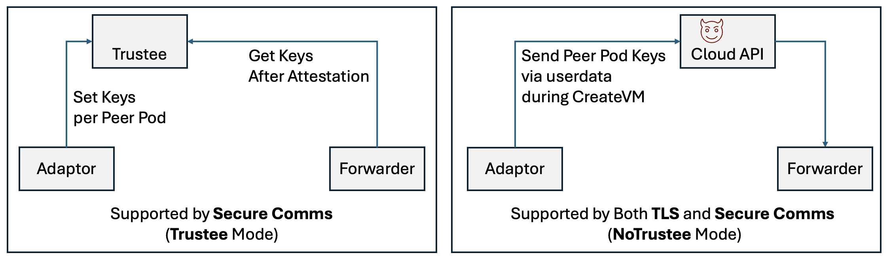
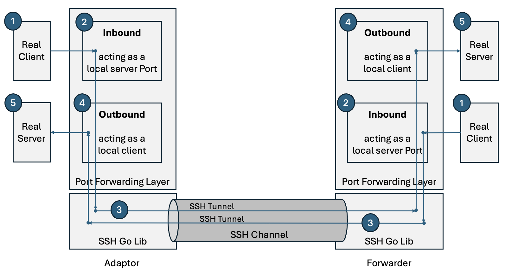

# Secure Communications

Here, we describe how to set up the Secure Communications (`Secure Comms` for short) feature of the `cloud-api-adaptor` (`Adaptor`) and `agent-protocol-forwarder` (`Forwarder`).

The `Secure Comms` feature establishes an SSH channel by the `Adaptor`, as an SSH client, and the `Forwarder`, as an SSH server. All control communications then use this SSH channel between the `Adaptor` and `Forwarder`. This feature is an alternative to using `TLS encryption` feature between the `Adaptor` and `Forwarder`. 

Both `Secure Comms` and `TLS encryption` supports a method of delivering keys to encrypt the control-plane traffic between the `Adaptor` and the `Forwarder` via user-data during pod VM creation. Delivering the keys via the user-data may allow a malicious entity on the cloud provider side to gain access to the keys and modify any communication between the Worker Nodes and Peer Pods. For this reason, `Secure Comms` also supports an alternate mode where the keys are delivered to the Peer Pod via `Trustee`. The keys are delivered to the Peer Pod after an attestation phase (See diagram below). Delivering the keys via `Trustee` protects the Peer Pod from a malicious entity on the cloud provider side. 
We name this mode of operation as `Trustee Mode`. The option of delivering keys via user-data is named  as `NoTrustee Mode`.

<p align="center">
  
</p>


To deliver the secrets via `Trustee`, `Secure Comms` under `Trustee Mode` uses a two-phase approach:
- Attestation Phase: In this phase, an SSH channel is created to enable the Peer Pod to attest against an attestation service. The attestation traffic is tunneled from the Peer Pod to the CAA and from there sent to a KBS as configured at the CAA. Once attestation is achieved, the Forwarder obtains Peer Pod keys from the KBS. The Peer Pod keys are dynamically added to the KBS by the CAA prior to starting the Peer Pod.
- Kubernetes Phase: In this phase, an SSH channel is created to enable the runtime to communicate with the Kata Agent running in the Peer Pod. This phase uses the keys obtained during the Attestation Phase, ensuring that the communication is secured.

Additional tunnels can be established via the SSH channel by configuring the Adaptor and Forwarder as described below.

## Secure Comms Architecture
`Secure Comms` uses a Go SSH Lib to secure the communication between the cluster Worker Nodes and Peer Pods. To communicate with the Peer Pods, an SSH channel is created between the `Adaptor` in the Worker Node and the `Forwarder` in the Peer Pod. 
The Worker Node is the client part of the channel, and the Peer Pod is the server part of the SSH channel. All communications between the Peer Pod and any services available on the Worker Node side can be configured to use the SSH channel.

Once an SSH channel is established, a Port Forwarding layer, implemented on top of the Go SSH Lib, is used to secure any port to port communication initiated between the `Adaptor` and `Forwarder` and vice versa (see diagram). A client (1) seeking to communicate to the other side, comunicates with a local Inbound component (2) instead. The local Inbound act as a local server for the client. Once a connection is made to the Inbound, a tunnel (3) is created between the local Inbound and a remote Outbound component (4) via the SSH channel. The remote Outbound than acts as a client on behalf of the real client (1) and connect to the remote server (5) to establish an end to end session between the real client (1) and real server (5).

<p align="center">
  
</p>


Once the SSH channel is created, clients at the Peer Pod side such as `Attestation Agent` connects to the services offered by the cluster side such as `KBS` using the channel. Likewise, clients located at the cluster side such as the `Kata shim`, connects to the services on the Peer Pod side such as the `Kata Agent` using the same channel.

As shown in the following diagram, using `SecureComms`, each Peer Pod is consequently served using a single communication channel implemented as an SSH channel. This single TCP session is initiated from the Worker Node and terminated at the Peer Pod. It is used for any control communication between the Worker Node and Peer Pod and vice versa. This consolidation of communication between a Worker Node and Peer Pod via a single SSH channel improves the operational aspects of Worker Node and Peer Pod communication, especially when Worker Node and Peer Pod are in different networks. The Worker Node network does not need to open ingress ports to expose services to Peer Pod. For example, when the communication between CDH (in Peer Pod) and the Trustee (in the Worker Node network) is via the SSH channel, the Trustee service port does not need to be open to enable communication with CDH (Peer Pod).

<p align="center">
  
</p>

`SecureComms` in `Trustee Mode` uses the following sequence of steps:
- Worker Node creates keys for the Peer Pod and updates Trustee
- Worker Node creates the Peer Pod VM
- Worker Node establishes an "Attestation Phase" SSH channel with the Peer Pod VM
- Peer Pod VM attests and obtain keys from Trustee. The Peer Pod then signal to the Worker Node that the "Attestation Phase" has ended and terminates the "Attestation Phase" SSH channel.
- Worker Node establishes a "Kubernetes Phase" SSH channel with the Peer Pod VM - Both sides verify the identity of the other side using the keys delivered via Trustee.

`SecureComms` in `NoTrustee Mode` uses the following sequence of steps:
- Worker Node creates keys for the Peer Pod
- Worker Node creates the Peer Pod VM and deliver the keys via daemonConfig as part of the userdata of the Cloud API.
- Peer Pod VM obtain keys from daemonConfig.
- Worker Node establishes a "Kubernetes Phase" SSH channel with the Peer Pod VM - Both sides verify the identity of the other side using the keys delivered via daemonConfig.

Once the "Kubernetes Phase" SSH channel is established, Secure Comms connects the `Kata shim` to the `Kata Agent` and may also connect other services required by the Peer Pod VM or by containers running inside the Peer Pod.

See [Secure Comms Architecture Slides](./SecureComms.pdf) for more details.

## Setup for testing and for non-CoCo peerpods with NoTrustee mode

### Deploy CAA
Use any of the option for installing CAA depending on the cloud driver used.


### Activate Secure-Comms feature from CAA side
Make the following parameter changes to the `peer-pods-cm` configMap in the `confidential-containers-system` namespace.
- Activate Secure-Comms from CAA side by setting the `SECURE_COMMS` parameter to `"true"`.  
- Deactivate Secure-Comms use of Trustee by setting the `SECURE_COMMS_NO_TRUSTEE` parameter to `"true"`.  

Use `kubectl edit cm peer-pods-cm -n confidential-containers-system` to make such changes in the configMap, for example:
```sh
apiVersion: v1
data:
    ...
    SECURE_COMMS: "true"
    SECURE_COMMS_NO_TRUSTEE: "true"
    ...
```

You may also include additional Inbounds and Outbounds configurations to the Adaptor side using the `SECURE_COMMS_INBOUNDS` and `SECURE_COMMS_OUTBOUNDS` config points.
You may also add Inbounds and Outbounds configurations to the Forwarder (I.e. Peer Pod, PP) side using the `SECURE_COMMS_PP_INBOUNDS` and `SECURE_COMMS_PP_OUTBOUNDS` config points. [See more details regarding Inbounds and Outbounds below.](#adding-named-tunnels-to-the-ssh-channel)

Use `kubectl edit cm peer-pods-cm -n confidential-containers-system` to make such changes in the configMap, for example:
```sh
apiVersion: v1
data:
    ...
    SECURE_COMMS: "true"
    SECURE_COMMS_NO_TRUSTEE: "true"
    SECURE_COMMS_OUTBOUNDS: "KUBERNETES_PHASE:mytunnel:149.81.64.62:7777"
    SECURE_COMMS_PP_INBOUNDS: "KUBERNETES_PHASE:mytunnel:podns:6666"
  
    ...
```

## Setup for CoCo with Trustee

### Deploy CAA
Use any of the option for installing CAA depending on the cloud driver used.

### Deploy Trustee-Operator
Deploy Trustee-Operator by following instructions at [trustee Operator Getting Started](https://github.com/confidential-containers/trustee-operator?tab=readme-ov-file#getting-started).

Make sure to uncomment the secret generation as recommended for both public and private key (`kbs-auth-public-key` and `kbs-client` secrets). After this installation step you should now have the following secrets in the `trustee-operator-system` namespace:

```sh
kubectl get secrets -n trustee-operator-system
NAME                  TYPE     DATA   AGE
kbs-auth-public-key   Opaque   1      28h
kbs-client            Opaque   1      28h
```

Now, you should copy the kbs-client secret from the `trustee-operator-system` namespace to the `confidential-containers-system` namespace. This can be done using:

```sh
kubectl get secret kbs-client -n trustee-operator-system -o json|jq --arg ns "confidential-containers-system" 'del(.metadata["creationTimestamp","resourceVersion","selfLink","uid","annotations"]) | .metadata.namespace |= $ns' |kubectl apply -f -
```

For a testing environment, you may need to change the policy of the KBS and AS using the KBS Client to allow all or fit your own policy. One way to do that is:

```sh
kubectl -n trustee-operator-system exec deployment/trustee-deployment --container as -it -- sed -i.bak 's/^default allow = false/default allow = true/' /opt/confidential-containers/attestation-service/opa/default.rego

kubectl -n trustee-operator-system get cm resource-policy -o yaml | sed "s/default allow = false/default allow = true/"|kubectl apply -f -
```

### Build a podvm that enforces Secure-Comms

Change the `src/cloud-api-adaptor/podvm/files/etc/systemd/system/agent-protocol-forwarder.service` to include:
```sh
ExecStart=/usr/local/bin/agent-protocol-forwarder -pod-namespace /run/netns/podns -secure-comms -kata-agent-socket /run/kata-containers/agent.sock $TLS_OPTIONS $OPTIONS
```

You may also include additional Inbounds and Outbounds configurations to the Forwarder using the `-secure-comms-inbounds` and `-secure-comms-outbounds` flags.  [See more details regarding Inbounds and Outbounds below.](#adding-named-tunnels-to-the-ssh-channel)

For example:
```sh
ExecStart=/usr/local/bin/agent-protocol-forwarder -kata-agent-namespace /run/netns/podns -secure-comms -secure-comms-inbounds KUBERNETES_PHASE:mytunnel:podns:6666 -kata-agent-socket /run/kata-containers/agent.sock $TLS_OPTIONS $OPTIONS
```

Once you changed `podvm/files/etc/systemd/system/agent-protocol-forwarder.service`, you will need to [rebuild the podvm](./../podvm/README.md).


### Activate CAA Secure-Comms feature
Activate Secure-Comms of CAA by changing the `SECURE_COMMS` parameter of the `peer-pods-cm` configMap in the `confidential-containers-system` namespace to `"true"`.  

```sh
kubectl -n confidential-containers-system  get cm peer-pods-cm  -o yaml | sed "s/SECURE_COMMS: \"false\"/SECURE_COMMS: \"true\"/"|kubectl apply -f -
```

Set InitData to point KBC services to IP address 127.0.0.1 
```sh
cat <<EOF > /tmp/initdata.txt
algorithm = "sha384"
version = "0.1.0"
[data]
"aa.toml" = '''
[token_configs]
[token_configs.coco_as]
url = 'http://127.0.0.1:8080'

[token_configs.kbs]
url = 'http://127.0.0.1:8080'
'''
"cdh.toml"  = '''
socket = 'unix:///run/confidential-containers/cdh.sock'
credentials = []
[kbc]
name = 'cc_kbc'
url = 'http://127.0.0.1:8080'
'''
EOF
export INITDATA=`cat /tmp/initdata.txt | gzip | base64 -w0`
kubectl -n confidential-containers-system  get cm peer-pods-cm  -o yaml | sed 's/^\s*INITDATA: .*/  INITDATA: '$INITDATA'/'|kubectl apply -f -
```

You may also include additional Inbounds and Outbounds configurations to the Adaptor using the `SECURE_COMMS_INBOUNDS` and `SECURE_COMMS_OUTBOUNDS` config points. [See more details regarding Inbounds and Outbounds below.](#adding-named-tunnels-to-the-ssh-channel)

Use `kubectl edit cm peer-pods-cm -n confidential-containers-system` to make such changes in the configMap, for example:
```sh
apiVersion: v1
data:
    ...
    SECURE_COMMS: "true"
    SECURE_COMMS_OUTBOUNDS: "KUBERNETES_PHASE:mytunnel:149.81.64.62:7777"
    ...
```

You may also set the KBS address using the `SECURE_COMMS_KBS_ADDR` config point.

> [!NOTE]
> After changing peer-pods-cm ConfigMap, reload the CAA damonset using:
> ```
> kubectl rollout restart daemonset cloud-api-adaptor-daemonset -n confidential-containers-system
> ```
>


## Adding named tunnels to the SSH channel
Named tunnels can be added to the SSH channel. Adding a named tunnel requires adding an Inbound at one of the SSH channel peers and an Outbound at the other SSH channel peer. The Inbound and Outbound both carry the name of the tunnel being created.

            |---------Tunnel----------| 
    Client->Inbound----------->Outbound->Server


Inbounds and Outbounds take the form of a comma separated inbound/outbound tags such that Inbounds are formed as "InboundTag1,InboundTag2,InboundTag3,..." and Outbounds are formed as "OutboundTag1,OutboundTag2,outboundTag3,..."

Each Inbound tag is structured as `Phase:Name:Namespace:Port` or `Phase:Name:Port` where:
- Phase can be 'KUBERNETES_PHASE' to represent an outbound available during the Kubernetes phase, 'ATTESTATION_PHASE' to represent an outbound available during the Attestation phase, or 'BOTH_PHASES' to represent an outbound available during both phases.
- Name is the name of the tunnel
- Namespace (if available) is a linux network namespace where the local service should be available.
- Port is the local service port being opened to serve as ingress of the tunnel.

Each outbound tag is structured as `Phase:Name:Host:Port` or `Phase:Name:Port` where:
- Phase can be 'KUBERNETES_PHASE' to represent an outbound available during the Kubernetes phase, 'ATTESTATION_PHASE' to represent an outbound available during the Attestation phase, or 'BOTH_PHASES' to represent an outbound available during both phases.
- Name is the name of the tunnel
- Host (if available) is a hostname or IP address of the destination host to forward the information to.
- Port is the destination port to forward the information to.

For example, an outbound tag such as `KUBERNETES_PHASE:ABC:myhost.com:1234` means that during the `Kubernetes phase`, an output of a tunnel named `ABC` is registered, such that information from a client connecting to ABC Inbound will be tunneled and forwarded to `myhost.com` port `1234`).

## Testing

Testing securecomms as a standalone can be done by using:
```sh
cd src/cloud-api-adaptor
go run ./test/securecomms/double/main.go
```
This will create a client and a server and mimic the connection between a CAA client to a Peer Pod Server
Successful connection result in exit code of 0

Alternatively, the client and server can be separately executed in independent terminals using `./test/securecomms/double/wnssh.go` and `./test/securecomms/ppssh/main.go` respectively.

# E2E Testing

To facilitate end-to-end testing, the libvirt github workflow `e2e_libvirt.yaml` adds an environment variable named `TEST_E2E_SECURE_COMMS` which indicates the secure comm configuration set to be used. The `config_libvirt.sh` uses this environment variable to set proper values in the `libvirt.properties` file.

## Future Plans

- Add DeleteResource() support in KBS, KBC, api-server-rest, than cleanup resources added by Secure Comms to KBS whenever a Peer Pod fail to be created or when a Peer Pod is terminated.
- Add support for KBS identities allowing a Peer Pod to register its own identity in KBS and replace the current Secure Comms mechanism which delivers a private key to the Peer Pod via the KBS
