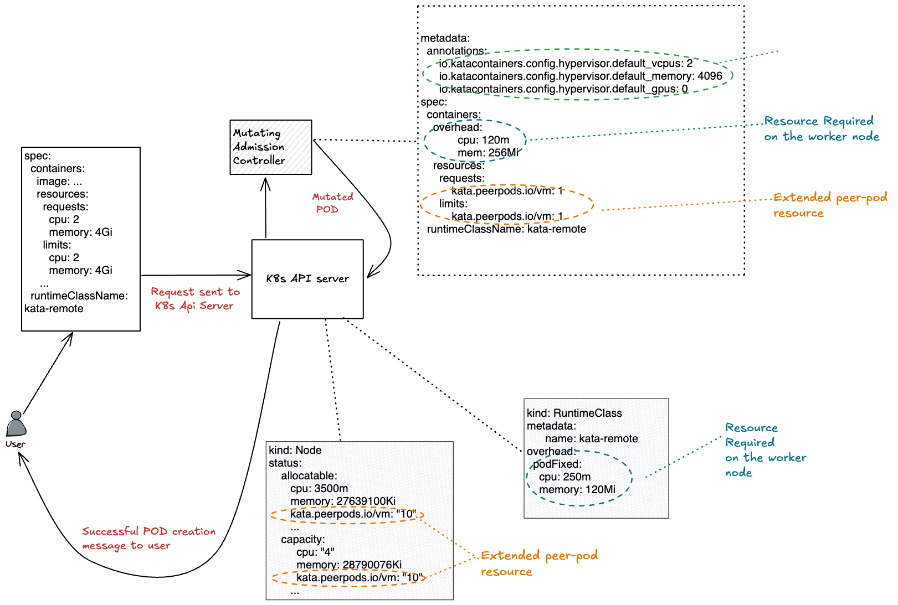

# Resource Accounting and Management for Peer Pods

A peer pod uses resources in two locations:

- The worker node. The worker node stores metadata, Kata shim resources (containerd-shim-kata-v2), remote-hypervisor resources (cloud-api-adaptor), and the tunnel setup between the worker nodes and the peer-pod virtual machine (VM).

- The cloud instance. This is the actual peer-pod VM running in the cloud.

The CPU and memory resources used in the Kubernetes worker node are handled by the [pod overhead](https://kubernetes.io/docs/concepts/scheduling-eviction/pod-overhead/) included in the RuntimeClass (`kata-remote`) definition used for creating peer pods.

As for the resource accounting and management for peer pods, we use Kubernetes Extended Resources and Mutation Admission Controller.

The peer pod capacity (ie, number of peer pod VMs) is defined using the Kubernetes [Node extended resources](https://kubernetes.io/docs/tasks/administer-cluster/extended-resource-node/).

This is per node and can be set using the `PEERPODS_LIMIT_PER_NODE` parameter in `peer-pods-cm` configMap. The default value is `10` peer pod VMs per worker node.

The extended resource is named `kata.peerpods.io/vm`, and enables the Kubernetes scheduler to handle capacity tracking and accounting.

A mutating webhook adds the extended resource `kata.peerpods.io/vm` to the spec by modifying the resources field of the first container in the pod. This enables the Kubernetes scheduler to account for these extended resources, ensuring the peer-pod is only scheduled when resources are available.

The webhook also removes every resource specification (cpu/mem/gpu) from the resources field of all containers and init containers in the pod and replaces it with the following pod annotations to help with the right cloud instance selection:

- io.katacontainers.config.hypervisor.default_gpus: <total_number_of_gpus_requested>
- io.katacontainers.config.hypervisor.default_mem: <total_memory_of_all_containers>
- io.katacontainers.config.hypervisor.default_vcpus: <total_vcpus_of_all_containers>

The following diagram describes the high level flow.

