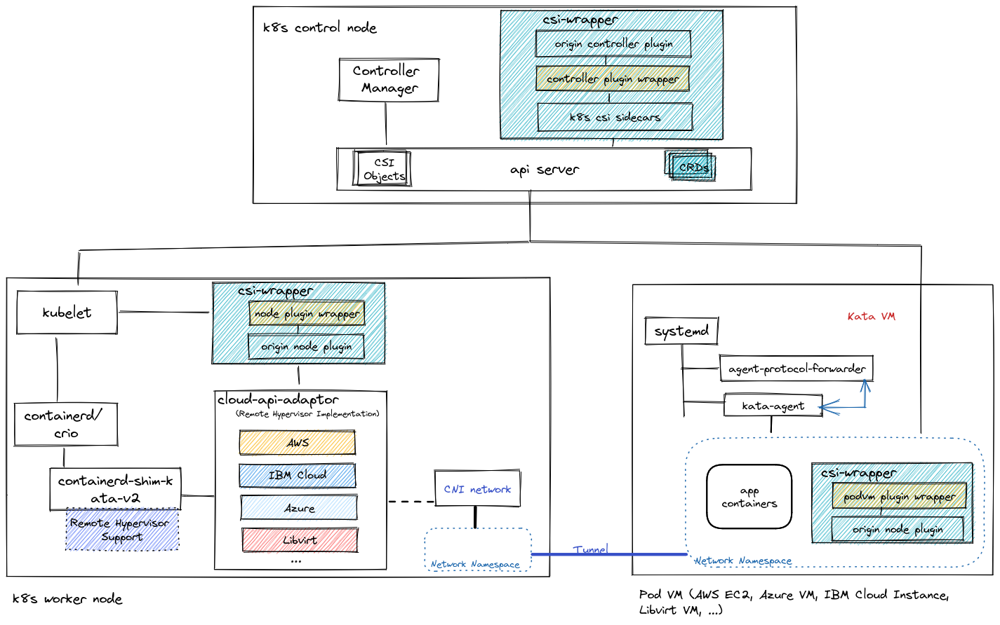

# csi-wrapper
CSI Wrapper for Peer Pod Storage

## High Level Design



> **Note** Edited via https://excalidraw.com/

## Test CSI Wrapper with ibm-vpc-block-csi-driver for peer pod demo on IBM Cloud VPC

### Set up a demo environment on your development machine

Follow the [README.md](../../ibmcloud/README.md) to setup a x86 based demo environment on IBM Cloud VPC.

### Deploy ibm-vpc-block-csi-driver on the cluster

1. Setup kubeconfig so that you can access the cluster using `kubectl`.

2. Clone the source code:
```bash
git clone https://github.com/kubernetes-sigs/ibm-vpc-block-csi-driver.git
cd ibm-vpc-block-csi-driver
git checkout v4.3.1
```

3. Apply the [ibm-vpc-block-csi-driver.patch](hack/ibm/ibm-vpc-block-csi-driver.patch) 
```bash
git apply /root/cloud-api-adaptor/volumes/csi-wrapper/hack/ibm/ibm-vpc-block-csi-driver.patch
```

4. Get your worker instance id
- Check your worker node name
```bash
kubectl get nodes -o wide
```
- Check your vsi instance id for worker node
```bash
export IBMCLOUD_API_KEY=<your_api_key>
/root/cloud-api-adaptor/ibmcloud/image/login.sh

```
> **Note** You can export `IBMCLOUD_API_ENDPOINT` and `IBMCLOUD_VPC_REGION` to use other regions
- List instances
```bash
ibmcloud is ins
```
The expected result should look like:
```bash
...
Listing instances in all resource groups and region jp-tok under account DaLi Liu's Account as user liudali@cn.ibm.com...
ID                                          Name                    Status    Reserved IP   Floating IP       Profile   Image                                VPC                       Zone       Resource group
02e7_fce373b4-f931-47f2-b2c7-1df0bfd3680e   csi-x86-cp              running   10.244.0.11   162.133.136.92    bx2-2x8   ibm-ubuntu-20-04-3-minimal-amd64-1   liudali-csi-wrapper-vpc   jp-tok-1   default
02e7_039e42ac-0fe2-4e94-b6a6-139e77c2db4f   csi-x86-worker          running   10.244.0.10   162.133.136.91    bx2-2x8   ibm-ubuntu-20-04-3-minimal-amd64-1   liudali-csi-wrapper-vpc   jp-tok-1   default
02e7_9230b72f-d44e-4bd7-9c38-874e49da20bc   podvm-nginx-4c0ac057    running   10.244.0.18   -                 bx2-2x8   podvm-82ae9f8-dirty-amd64            liudali-csi-wrapper-vpc   jp-tok-1   default
```
In the example `02e7_039e42ac-0fe2-4e94-b6a6-139e77c2db4f` is the instanceID, `csi-x86-worker` is the `node-name`, `jp-tok` is the region, `jp-tok-2` is the zone.

5. Run the script:
```bash
bash ./scripts/apply-required-setup.sh <node-name> <instanceID> <region-of-instanceID> <zone-of-instanceID>
```
The expected result looks like:
```bash
root@csi-x86-worker:~/ibm-vpc-block-csi-driver# bash ./scripts/apply-required-setup.sh csi-x86-worker 02e7_039e42ac-0fe2-4e94-b6a6-139e77c2db4f jp-tok jp-tok-1
csi-x86-worker   Ready    <none>          2d1h   v1.26.0
node/csi-x86-worker labeled
node/csi-x86-worker labeled
node/csi-x86-worker labeled
node/csi-x86-worker labeled
node/csi-x86-worker labeled
node/csi-x86-worker labeled
root@csi-x86-worker:~/ibm-vpc-block-csi-driver#
```

6. Update the [slclient_Gen2.toml](https://github.com/kubernetes-sigs/ibm-vpc-block-csi-driver/blob/master/deploy/kubernetes/driver/kubernetes/slclient_Gen2.toml) for the cluster:
```bash
export IBMCLOUD_VPC_REGION=<the_region_name>
export IBMCLOUD_RESOURCE_GROUP_ID=<check via `ibmcloud resource groups`>
export IBMCLOUD_API_KEY=<your ibm cloud API key>
cat <<END > /root/ibm-vpc-block-csi-driver/deploy/kubernetes/driver/kubernetes/slclient_Gen2.toml
[server]
debug_trace = false

[vpc]
iam_client_id = "bx"
iam_client_secret = "bx"
g2_token_exchange_endpoint_url = "https://iam.bluemix.net"
g2_riaas_endpoint_url = "https://${IBMCLOUD_VPC_REGION}.iaas.cloud.ibm.com"
g2_resource_group_id = "${IBMCLOUD_RESOURCE_GROUP_ID}"
g2_api_key = "${IBMCLOUD_API_KEY}"
provider_type = "g2"
END
cat /root/ibm-vpc-block-csi-driver/deploy/kubernetes/driver/kubernetes/slclient_Gen2.toml
```
> **Note** Please export `IBMCLOUD_VPC_REGION`, `IBMCLOUD_RESOURCE_GROUP_ID`, `IBMCLOUD_API_KEY` with correct values and check what the file was updated.

7. Install **kustomize** tool
```bash
curl -s "https://raw.githubusercontent.com/kubernetes-sigs/kustomize/master/hack/install_kustomize.sh"  | bash
mv kustomize /usr/local/bin
```

8. Deploy `ibm-vpc-block-csi-driver` using **stage** overlay:
```bash
encodeVal=$(base64 -w 0 deploy/kubernetes/driver/kubernetes/slclient_Gen2.toml)
sed -i "s/REPLACE_ME/$encodeVal/g" deploy/kubernetes/driver/kubernetes/manifests/storage-secret-store.yaml
kustomize build deploy/kubernetes/driver/kubernetes/overlays/stage | kubectl apply -f -
```
Check `ibm-vpc-block-csi-driver related` pod status
```bash
root@csi-x86-worker:~/cloud-api-adaptor# kubectl get po -A -o wide | grep vpc
kube-system    ibm-vpc-block-csi-controller-0       5/5     Running            0               25m    172.20.1.4    csi-x86-worker   <none>           <none>
kube-system    ibm-vpc-block-csi-node-r9rjl         2/3     CrashLoopBackOff   9 (4m38s ago)   25m    172.20.0.4    csi-x86-cp       <none>           <none>
kube-system    ibm-vpc-block-csi-node-vfpq5         3/3     Running            0               25m    172.20.1.5    csi-x86-worker   <none>           <none>
root@csi-x86-worker:~/cloud-api-adaptor#
```
> **Note**
> - The `CrashLoopBackOff` for node plugin `ibm-vpc-block-csi-node-r9rjl` on controller node is expected
> - Make sure the controller plugin **ibm-vpc-block-csi-controller-0** is scheduled to the VSI worker node. If not, try to add `nodeSelector` to deployment yaml for `ibm-vpc-block-csi-controller`.
> You can check it by follow command:
> ```bash
> kubectl -n kube-system describe po ibm-vpc-block-csi-controller-0 |grep Node:
> Node:             csi-x86-worker/10.244.0.10
> ```

### Deploy csi-wrapper to patch on ibm-vpc-block-csi-driver

1. Create the PeerpodVolume CRD object
```bash
cd /root/cloud-api-adaptor/
kubectl create -f volumes/csi-wrapper/crd/peerpodvolume.yaml
```
The output looks like:
```bash
customresourcedefinition.apiextensions.k8s.io/peerpodvolumes.confidentialcontainers.org created
```
2. Create vpc-block-csi-wrapper-runner role  bind to ibm-vpc-block-controller-sa account
```bash
kubectl create -f volumes/csi-wrapper/hack/ibm/vpc-block-csi-wrapper-runner.yaml
```
The output looks like:
```
clusterrole.rbac.authorization.k8s.io/vpc-block-csi-wrapper-runner created
clusterrolebinding.rbac.authorization.k8s.io/vpc-block-csi-wrapper-controller-binding created
clusterrolebinding.rbac.authorization.k8s.io/vpc-block-csi-wrapper-node-binding created
```

3. patch ibm-vpc-block-csi-driver:
```bash
kubectl patch statefulset ibm-vpc-block-csi-controller -n kube-system --patch-file hack/ibm/patch-controller.yaml
kubectl patch ds ibm-vpc-block-csi-node -n kube-system --patch-file hack/ibm/patch-node.yaml
```

4. Check pod status now:
```bash
kubectl get po -A -o wide | grep vpc
kube-system    ibm-vpc-block-csi-controller-0       6/6     Running             0             8m18s   172.20.1.6    csi-x86-worker   <none>           <none>
kube-system    ibm-vpc-block-csi-node-7kj9b         4/4     Running             0             8m5s    172.20.1.7    csi-x86-worker   <none>           <none>
kube-system    ibm-vpc-block-csi-node-r7b5w         0/4     ContainerCreating   0             8m5s    <none>        csi-x86-cp       <none>           <none>
```
> **Note** The `ibm-vpc-block-csi-node-r7b5w` pod won't in `Running` status as it's on control node, just ignore it.

5. Create **storage class** for Peerpod:
```bash
kubectl apply -f hack/ibm/ibm-vpc-block-5iopsTier-StorageClass-for-peerpod.yaml
```

## Run the `csi-wrapper for peerpod storage` demo

1. Create one pvc that use `ibm-vpc-block-csi-driver`
```bash
kubectl create -f hack/ibm/my-pvc-kube-system.yaml
```

2. Wait for the pvc status to become `bound`
```bash
kubectl -n kube-system get pvc
NAME     STATUS   VOLUME                                     CAPACITY   ACCESS MODES   STORAGECLASS                AGE
my-pvc   Bound    pvc-8e258388-3493-45fd-a92b-e4576ccdce7c   10Gi       RWO            ibmc-vpc-block-5iops-tier   19s
```

3. Create nginx peer-pod demo with with `podvm-wrapper` and `ibm-vpc-block-csi-driver` container
```bash
kubectl create -f hack/ibm/nginx-kata-with-my-pvc-and-csi-wrapper.yaml
```

4. Wait 2 minutes, check if the `nginx` pod is running:
```bash
kubectl get po -A | grep nginx
kube-system   nginx                                                 3/3     Running             0              101s
```

5. Check the `PeerpodVolume` crd object and the state is `nodePublishVolumeApplied`
- Getting `PeerpodVolume` objects:
```bash
kubectl get PeerpodVolume -A
NAMESPACE     NAME                                        AGE
kube-system   r022-31f30b9b-556b-4a5d-80b0-419270a8783e   11m
```
- Using name get the state of the PeerpodVolume:
```bash
kubectl -n kube-system get PeerpodVolume r022-31f30b9b-556b-4a5d-80b0-419270a8783e -o yaml |grep state
  state: nodePublishVolumeApplied
```

6. Exec into nginx container check the mount:
```bash
kubectl exec nginx -n kube-system -c nginx -i -t -- sh
# lsblk
NAME    MAJ:MIN RM  SIZE RO TYPE MOUNTPOINT
loop0     7:0    0 91.8M  1 loop
loop1     7:1    0 63.2M  1 loop
loop2     7:2    0 49.6M  1 loop
vda     252:0    0  100G  0 disk
|-vda1  252:1    0 99.9G  0 part /run/secrets/kubernetes.io/serviceaccount
|-vda14 252:14   0    4M  0 part
`-vda15 252:15   0  106M  0 part
vdb     252:16   0  372K  0 disk
vdc     252:32   0   44K  0 disk
vdd     252:48   0   10G  0 disk /mount-path
# ls /mount-path
lost+found
```
> **Note** We can see, the device **vdd** is mounted to `/mount-path` in nginx container as expected.

- Create a file under `/mount-path`
```bash
echo "from nignx container date:" $(date) > /mount-path/incontainer.log
```
- On the development machine check the created vsi pod:
```bash
ibmcloud is ins |grep nginx
02e7_d9d5d4f4-d188-4c96-8f7b-c390b97f7aa4   podvm-nginx-1c0b9c12    running   10.244.0.4     -                 bx2-2x8    podvm-82ae9f8-dirty-amd64            liudali-csi-wrapper-vpc   jp-tok-1   default
```
- Using the VSI pod ID, get the network interface id:
```bash
ibmcloud is in 02e7_d9d5d4f4-d188-4c96-8f7b-c390b97f7aa4 | grep -A 2  "Network Interfaces"
Network Interfaces                    Interface   Name                              ID                                          Subnet                    Subnet ID                                   Floating IP   Security Groups                   Allow source IP spoofing   Reserved IP
                                      Primary     snowless-defamed-dolphin-caller   02e7-663133fd-94aa-4d6b-bf2f-2163280dabf1   liudali-csi-wrapper-sn1   02e7-bf2a1bf2-5f94-4290-b422-b51f449a37a3   -             castle-duchess-regalia-dynamite   false                      10.244.0.4
```
- With the network interface ID, create a floating ip for the pod VSI
```bash
ibmcloud is ipc my-ip --nic 02e7-663133fd-94aa-4d6b-bf2f-2163280dabf1
Creating floating IP my-ip under account DaLi Liu's Account as user liudali@cn.ibm.com...

ID               r022-be4950a9-1f88-45ae-be9b-bfcdbcd07b53
Address          162.133.135.79
...
```
- Login to the created vsi
```bash
ssh root@162.133.135.79
```
- Check the mount point:
```bash
root@podvm-nginx-1c0b9c12:~# lsblk
NAME    MAJ:MIN RM  SIZE RO TYPE MOUNTPOINT
loop0     7:0    0 91.8M  1 loop /snap/lxd/23991
loop1     7:1    0 63.2M  1 loop /snap/core20/1695
loop2     7:2    0 49.6M  1 loop /snap/snapd/17883
vda     252:0    0  100G  0 disk
├─vda1  252:1    0 99.9G  0 part /
├─vda14 252:14   0    4M  0 part
└─vda15 252:15   0  106M  0 part /boot/efi
vdb     252:16   0  372K  0 disk
vdc     252:32   0   44K  0 disk
vdd     252:48   0   10G  0 disk /var/lib/kubelet/pods/710bf7cb-aada-4cf1-9266-b90afd9c4921/volumes/kubernetes.io~csi/pvc-8e258388-3493-45fd-a92b-e4576ccdce7c/mount
root@podvm-nginx-1c0b9c12:~#
```
> **Note** We can see, the device **vdd** is mounted to `/var/lib/kubelet/pods/710bf7cb-aada-4cf1-9266-b90afd9c4921/volumes/kubernetes.io~csi/pvc-8e258388-3493-45fd-a92b-e4576ccdce7c/mount` in the vsi as expected.

- Check the created file from container
```
cat /var/lib/kubelet/pods/710bf7cb-aada-4cf1-9266-b90afd9c4921/volumes/kubernetes.io~csi/pvc-8e258388-3493-45fd-a92b-e4576ccdce7c/mount/incontainer.log
from nignx container date: Wed Dec 28 16:55:16 UTC 2022
```
